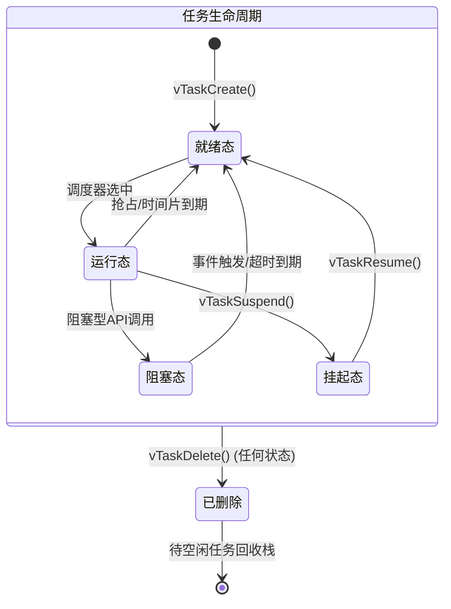

实时操作系统（Real-Time Operating System, RTOS）是嵌入式领域的核心系统软件，其调度策略的设计直接决定任务响应的确定性与时间可预测性。

FreeRTOS 是全球市场占有率长期领先的开源实时操作系统——它用约 9000 行 C 代码，在仅约 6 KB ROM / 1 KB RAM 的最小配置下实现了微秒级的任务切换与有界中断延迟。这种“以最简洁的机制换取最强的确定性”的工程哲学，正是它值得被仔细拆解的地方。

本文将以 FreeRTOS 为研究对象，完整梳理其任务模型、调度算法、上下文切换机制、实时性保障手段及性能特征，并给出可调度性验证方法与典型行业的应用数据。

<!--more-->

## 引言

### 实时操作系统的定义与分类

实时操作系统是能在规定时间约束内完成特定任务处理的操作系统。区别于通用操作系统追求的高吞吐量与平均性能，RTOS 的核心指标是**时间确定性（Temporal Determinism）**——系统对外部事件的响应时间必须有可验证的上界。

根据截止时间违反的后果，实时任务可分为三类：

| 类型 | 定义 | 截止时间违反后果 | 典型场景 |
| :--- | :--- | :--- | :--- |
| 硬实时（Hard RT） | 必须在截止时间前完成 | 系统失效，可能造成灾难 | 飞控、ABS 制动、心脏起搏器 |
| 固实时（Firm RT） | 截止时间后结果无效 | 结果丢弃，但系统不失效 | 金融报价流、直播帧渲染 |
| 软实时（Soft RT） | 截止时间尽量满足 | 性能降级，偶尔违反可容忍 | 视频点播缓冲、GPS 导航刷新 |

### FreeRTOS 的地位与背景

FreeRTOS 由英国工程师 Richard Barry 于 2003 年创建，2017 年由 Amazon Web Services（AWS）接管并持续维护至今（商业强化版本曾称 Amazon FreeRTOS，现已统一更名为 FreeRTOS）。根据 2022 年 EE Times 嵌入式市场调查报告，FreeRTOS 在 RTOS 市场占有率达到 **34%**，连续多年位居第一，远超 Micrium µC/OS（9%）、VxWorks（8%）、ThreadX（7%）等商业 RTOS。

截至 FreeRTOS v10.5，其代码规模如下：

| 模块 | 代码行数 |
| :--- | :--- |
| 内核核心（`tasks.c`） | ~4500 行 |
| 队列/信号量（`queue.c`） | ~2800 行 |
| 定时器（`timers.c`） | ~1000 行 |
| 移植层（`port.c`，以 Cortex-M4 为例） | ~300 行 |
| **合计** | **~9000 行** |

编译后的二进制大小（以 ARM Cortex-M4，GCC `-O2` 优化为例）：

| 配置 | Flash（ROM）占用 | RAM 占用 |
| :--- | :--- | :--- |
| 最小配置（仅任务 + 调度） | ~6 KB | ~1 KB |
| 标准配置（含队列、信号量、定时器） | ~10 KB | ~2–4 KB |
| 完整配置（含 FPU、统计、追踪） | ~16 KB | ~6–8 KB |

这一极低的资源占用使 FreeRTOS 能够运行在 Flash 仅 32 KB、RAM 仅 8 KB 的低端 MCU 上，覆盖了从 8 位 AVR 到 64 位 RISC-V 的广泛平台。

## 实时调度理论基础

### 速率单调调度（RMS）

Liu 和 Layland 于 1973 年发表的论文《Scheduling Algorithms for Multiprogramming in a Hard-Real-Time Environment》，提出了两个奠基性的实时调度算法，其中之一便是**速率单调调度（Rate Monotonic Scheduling, RMS）**。

RMS 是一种静态优先级分配算法：任务的调度优先级与其执行周期成反比，即**周期越短，优先级越高**。它是在抢占式调度下固定优先级策略中的**最优算法**——若任何固定优先级分配方案能使任务集合满足截止时间，RMS 也必然能满足。

对于 $n$ 个独立的周期性任务，RMS 的 CPU 利用率可调度上界为：

$$
U_{\text{RMS}} = \sum_{i=1}^{n} \frac{C_i}{T_i} \leq n(2^{1/n} - 1)
$$

其中 $C_i$ 为任务 $i$ 的最坏情况执行时间（Worst-Case Execution Time, WCET），$T_i$ 为任务周期。当 $n \to \infty$ 时：

$$
U_{\text{RMS}}^{\max} = \lim_{n \to \infty} n(2^{1/n} - 1) = \ln 2 \approx 69.3\%
$$

各任务数对应的 RMS 利用率上界（工程上通常会再留出余量）：

| 任务数 $n$ | $n(2^{1/n}-1)$ | 工程推荐上界（留余量） |
| :---: | :---: | :---: |
| 1 | 100.0% | 80% |
| 2 | 82.8% | 70% |
| 3 | 78.0% | 65% |
| 5 | 74.3% | 60% |
| 10 | 71.8% | 57% |
| $\infty$ | 69.3% | 55% |

### 最早截止时间优先（EDF）

**最早截止时间优先（Earliest Deadline First, EDF）** 是动态优先级算法：在每次调度决策时，选择距截止时间最近的就绪任务执行。EDF 是单处理器抢占式调度下的**最优算法**，其理论 CPU 利用率上界可达：

$$
U_{\text{EDF}} \leq 1 = 100\%
$$

EDF 的调度利用率优于 RMS，但其动态优先级特性增加了运行时开销，且在过载情况下的行为难以预测（可能导致多个任务同时错过截止时间）。FreeRTOS 官方实现未采用 EDF，工程上通常选择 RMS 兼容的固定优先级方案，以换取更好的可预测性。

### 优先级反转与优先级继承

**优先级反转（Priority Inversion）** 是实时系统中的经典问题，指高优先级任务被低优先级任务间接阻塞，导致调度语义被破坏。

典型场景（三任务模型）：低优先级任务 L 持有互斥量运行，高优先级任务 H 就绪后尝试获取该互斥量而阻塞；此时中优先级任务 M 就绪，由于 H 在等待、L 未运行，M 得以抢占 CPU 并长时间运行——H 被“间接”地压在了 M 之后。

```mermaid
gantt
    title 优先级反转时序图
    dateFormat X
    axisFormat %s

    section Task_H（高）
    等待Mutex :crit, wait, 3, 12
    获取Mutex并执行 :done, run_h, 13, 16

    section Task_M（中）
    抢占L,长时间运行 :active, run_m, 5, 12

    section Task_L（低）
    获取Mutex并运行 :active, run_l1, 0, 3
    被抢占 :wait_l, 3, 12
    继续运行并释放Mutex :active, run_l2, 12, 13
```



*图 1：优先级反转时序图（无优先级继承时）*

::alert{type="danger"}
1997 年，NASA 火星探路者（Mars Pathfinder）任务中曾因优先级反转导致系统频繁复位，最终靠远程补丁在 vxWorks 的互斥量中启用优先级继承才得以解决——这是工程史上最著名的优先级反转事故之一。
::

## FreeRTOS 任务模型与数据结构

### 任务控制块（TCB）

FreeRTOS 中每个任务由一个**任务控制块（Task Control Block, TCB）** 描述，其核心字段如下：

```c
typedef struct tskTaskControlBlock {
    volatile StackType_t *pxTopOfStack;       /* 栈顶指针（必须为第一个字段） */

    ListItem_t xStateListItem;                /* 用于插入状态链表（就绪/阻塞/挂起） */
    ListItem_t xEventListItem;                /* 用于插入事件等待链表 */

    UBaseType_t uxPriority;                   /* 任务优先级（0=最低） */
    StackType_t *pxStack;                     /* 栈底指针 */
    char pcTaskName[configMAX_TASK_NAME_LEN]; /* 任务名（调试用） */

#if ( configUSE_MUTEXES == 1 )
    UBaseType_t uxBasePriority;               /* 优先级继承前的原始优先级 */
    UBaseType_t uxMutexesHeld;                /* 持有互斥量数量 */
#endif

#if ( configUSE_TASK_NOTIFICATIONS == 1 )
    volatile uint32_t ulNotifiedValue;        /* 任务通知值 */
    volatile uint8_t ucNotifyState;           /* 通知状态 */
#endif

    /* 运行时统计（可选） */
    uint32_t ulRunTimeCounter;                /* 累计运行时钟周期 */
} TCB_t;
```

其中两个细节值得注意：

- `pxTopOfStack` **必须是结构体的第一个字段**——上下文切换的汇编代码会直接把 TCB 指针解引用为栈顶指针，不做偏移计算；
- `uxBasePriority` 仅在启用互斥量时存在——它记录优先级继承前的原始优先级，用于互斥量释放后恢复现场。

### 任务状态机

FreeRTOS 任务在其生命周期内经历以下五种状态的转换：



*图 2：任务生命周期状态转换图*

各状态转换的触发条件如下：

| 转换 | 触发方式 |
| :--- | :--- |
| Ready → Running | 调度器在 Tick 中断或抢占点选中 |
| Running → Blocked | `vTaskDelay()`、`xQueueReceive()`、`xSemaphoreTake()` 等阻塞调用 |
| Blocked → Ready | 阻塞超时到期，或等待的事件（队列非空、信号量可用）发生 |
| Running → Suspended | `vTaskSuspend(xTask)` |
| Suspended → Ready | `vTaskResume(xTask)` 或中断中 `vTaskResumeFromISR()` |

挂起态与阻塞态的区别容易被混淆：**阻塞态有超时约束，等待的是事件；挂起态没有超时，等待的是显式的恢复调用**。因此挂起态的任务即使其等待的事件发生也不会被唤醒。


## FreeRTOS 核心调度机制

### 就绪队列的数据结构设计

FreeRTOS 调度器的核心数据结构是**优先级就绪链表数组 + 优先级位图**，这是其 $O(1)$ 调度复杂度的基础：

```c
/* 内核全局变量 */
PRIVILEGED_DATA static List_t pxReadyTasksLists[configMAX_PRIORITIES];

/* 当前最高就绪优先级（位图实现） */
#if ( configUSE_PORT_OPTIMISED_TASK_SELECTION == 1 )
    /* 方法一：硬件 CLZ（Count Leading Zeros）指令加速 */
    #define portGET_HIGHEST_PRIORITY(uxTopPriority, uxReadyPriorities) \
        uxTopPriority = (31UL - (uint32_t)__clz((uxReadyPriorities)))
#else
    /* 方法二：通用软件位扫描 */
    static volatile UBaseType_t uxTopReadyPriority;
#endif
```

查找最高优先级就绪任务的过程：

```c
#define taskSELECT_HIGHEST_PRIORITY_TASK()                                    \
{                                                                             \
    UBaseType_t uxTopPriority;                                                \
    /* 步骤 1：通过位图（CLZ 指令）找到最高就绪优先级，O(1) */                \
    portGET_HIGHEST_PRIORITY(uxTopPriority, uxTopReadyPriority);              \
    /* 步骤 2：从该优先级的链表中取下一个任务（支持同级轮转），O(1) */        \
    pxCurrentTCB = listGET_OWNER_OF_NEXT_ENTRY(                               \
                        &(pxReadyTasksLists[uxTopPriority]));                 \
}
```

整个调度决策过程仅需 **1 条 CLZ 硬件指令 + 几次指针操作**，在 168 MHz 的 Cortex-M4 上执行时间约为 **6–12 ns**，对系统实时性的影响可忽略不计。

这里的设计思想与 Linux CFS 的红黑树（$O(log n)$）形成鲜明对比：FreeRTOS 用“**空间换时间**”——维护 32 条链表几乎不占额外计算，却把调度决策压缩到了常数时间。对于任务数量少（通常 3~20 个）但时序要求严苛的嵌入式场景，这是更合适的选择。

### 三种调度模式详解

FreeRTOS 的调度行为通过 `FreeRTOSConfig.h` 中的宏配置，支持三种模式：

::tabs
#P-固定优先级抢占式（默认）

```c
/* FreeRTOSConfig.h —— 默认模式 */
#define configUSE_PREEMPTION       1
#define configUSE_TIME_SLICING     0
#define configMAX_PRIORITIES       32   /* 32 个优先级，0 最低，31 最高 */
#define configTICK_RATE_HZ         1000 /* 1ms 系统心跳 */
```

调度规则：

1. 每个任务拥有 0 ~ `configMAX_PRIORITIES - 1` 之间的**静态优先级**，数值越大优先级越高；
2. 调度器始终运行**就绪队列中优先级最高**的任务；
3. 当更高优先级任务进入就绪态时（无论是从阻塞态恢复，还是由 ISR 释放同步原语），当前任务**立即被抢占**，发生上下文切换；
4. 相同优先级的任务不切换，按 FIFO 顺序持续执行直到主动放弃 CPU。

#T-时间片轮转

```c
/* FreeRTOSConfig.h —— 同级时间片轮转 */
#define configUSE_PREEMPTION       1
#define configUSE_TIME_SLICING     1   /* 开启同级时间片轮转 */
#define configTICK_RATE_HZ         1000
```

在抢占式调度基础上，相同优先级的多个就绪任务将**按时间片轮转执行**。每次 Tick 中断（1ms）发生时，若就绪队列中存在与当前任务同等优先级的其他任务，则切换到同级链表中的下一个任务。

:::alert{type="warning"}
时间片轮转仅发生在**同优先级任务之间**，不同优先级之间依然是纯抢占关系——时间片轮转不会让低优先级任务获得运行机会。
:::

#C-协作式

```c
/* FreeRTOSConfig.h —— 协作式调度 */
#define configUSE_PREEMPTION  0  /* 关闭抢占 */
```

关闭抢占后，CPU 只能被以下方式释放：

- 任务主动调用 `taskYIELD()`；
- 任务进入阻塞态（调用阻塞型 API）；
- 任务调用 `vTaskDelete()` 删除自身。

协作式调度适合对任务切换时机有严格控制要求的场景（如需要操作大量共享数据而不希望中途被抢占），但牺牲了实时响应性。
::

**调度时序示意（三优先级任务，H=3 > M=2 > L=1）：**

```mermaid
gantt
    title 固定优先级抢占式调度时序图 (H=3, M=2, L=1)
    dateFormat X
    axisFormat t%s

    section Task_H
    运行 :active, h1, 2, 4
    运行 :active, h2, 8, 9

    section Task_M
    运行 :active, m1, 4, 7

    section Task_L
    运行 :active, l1, 0, 2
    被H抢占 :crit, w1, 2, 4
    被M抢占 :crit, w2, 4, 7
    运行 :active, l2, 7, 8
    被H抢占 :crit, w3, 8, 9
    运行 :active, l3, 9, 12
```



*图 3：固定优先级抢占式调度时序图*

注意 L 在 4~7 段被“间接”推迟了 3 个时间单位：H 与 M 的抢占是直接可解释的，但 M 之所以能运行，是因为 H 已进入阻塞（或尚未就绪）。这也是为什么**中断延迟与最长阻塞时间**才是硬实时系统关注的关键指标。

**同优先级时间片轮转的时序（时间片 = 1 Tick = 1ms）：**

```mermaid
gantt
    title 同优先级时间片轮转调度时序图 (时间片 = 1 Tick = 1ms)
    dateFormat X
    axisFormat %s ms

    section Task_A
    运行 :active, a1, 0, 1
    运行 :active, a2, 3, 4
    运行 :active, a3, 6, 7

    section Task_B
    运行 :active, b1, 1, 2
    运行 :active, b2, 4, 5
    运行 :active, b3, 7, 8

    section Task_C
    运行 :active, c1, 2, 3
    运行 :active, c2, 5, 6
```



*图 4：同优先级时间片轮转调度时序图*

### 上下文切换机制（以 ARM Cortex-M4 为例）

上下文切换是实时调度的关键执行路径，其开销直接决定系统的最大任务切换频率和中断响应延迟。

#### 触发机制：PendSV 异常

FreeRTOS 在 ARM Cortex-M 架构上利用 **PendSV（Pendable Service Call）异常**执行上下文切换。PendSV 被配置为系统中最低优先级的异常，确保上下文切换仅在所有其他 ISR 执行完毕后才进行，避免中断嵌套期间切换任务导致的不一致。

**切换触发路径：**

```text
路径一：Tick 中断
SysTick_Handler() → xTaskIncrementTick() → 检查是否需要切换
→ 若需要，设置 SCB->ICSR |= SCB_ICSR_PENDSVSET → PendSV 挂起

路径二：高优先级任务就绪（ISR 中释放信号量等）
xSemaphoreGiveFromISR() → xTaskResumeFromISR() → 更新就绪队列
→ portYIELD_FROM_ISR() → 设置 PendSV → PendSV 挂起
```

这个“延迟切换”的设计非常巧妙：ISR 中只需设置一个挂起标志位，真正的上下文切换被推迟到所有中断处理完成后。这样既保证了切换过程不会被高优先级中断打断，也避免了在中断嵌套的复杂状态中操作任务栈。

#### 上下文保存与恢复（汇编核心代码）

```asm
; FreeRTOS Cortex-M4 PendSV 处理函数（简化注释版）
xPortPendSVHandler:
    ; ── 保存当前任务上下文 ──
    mrs  r0, psp               ; 读取进程栈指针（任务使用 PSP）
    isb                        ; 指令同步屏障

    ldr  r3, =pxCurrentTCB     ; 加载当前 TCB 指针地址
    ldr  r2, [r3]

    ; 保存 R4-R11（硬件自动保存 R0-R3, R12, LR, PC, xPSR）
    stmdb r0!, {r4-r11, r14}   ; 将 R4-R11 和 LR 压栈，r0 更新为新栈顶
    str   r0, [r2]             ; 将新栈顶保存到 TCB.pxTopOfStack

    ; ── 调度器选择下一任务 ──
    stmdb sp!, {r3, r14}       ; 保存 r3, lr 到 MSP（主栈）
    mov  r0, #configMAX_SYSCALL_INTERRUPT_PRIORITY
    msr  basepri, r0           ; 关闭低优先级中断（临界区）
    bl   vTaskSwitchContext    ; 调用 C 函数：更新 pxCurrentTCB
    mov  r0, #0
    msr  basepri, r0           ; 重新开启中断
    ldmia sp!, {r3, r14}       ; 恢复 r3, lr

    ; ── 恢复新任务上下文 ──
    ldr  r1, [r3]              ; 加载新任务 TCB
    ldr  r0, [r1]              ; 读取新任务栈顶
    ldmia r0!, {r4-r11, r14}   ; 从栈中恢复 R4-R11
    msr  psp, r0               ; 更新 PSP 为新任务栈顶
    isb
    bx   r14                   ; 返回（硬件自动恢复 R0-R3, R12, PC, xPSR）
```

Cortex-M 的硬件机制在这里减少了一半工作量：**R0-R3、R12、LR、PC、xPSR 由硬件在异常入口/出口自动保存与恢复**，软件只需处理 R4-R11 等调用者保存寄存器。FPU 启用时，额外的 S0-S15、FPSCR 等浮点上下文也由硬件按需保存。

#### 上下文切换性能实测数据

以下数据来自 FreeRTOS 官方及社区 Benchmark，测试方法为 GPIO 翻转计时：

| 处理器平台 | 主频 | 不含 FPU 切换时间 | 含 FPU 切换时间 | 最大中断延迟 |
| :--- | :---: | :---: | :---: | :---: |
| ARM Cortex-M4（STM32F407） | 168 MHz | ~0.68 μs | ~1.52 μs | 2.5 μs |
| ARM Cortex-M4（STM32F446） | 180 MHz | ~0.63 μs | ~1.40 μs | 2.3 μs |
| ARM Cortex-M3（STM32F103） | 72 MHz | ~1.76 μs | N/A | 5.8 μs |
| ARM Cortex-M0+（RP2040） | 133 MHz | ~1.20 μs | N/A | 4.5 μs |
| ARM Cortex-A7（i.MX6UL） | 528 MHz | ~1.50 μs | ~3.20 μs | 8.0 μs |
| RISC-V（ESP32-C3） | 160 MHz | ~1.05 μs | N/A | 4.0 μs |

## 实时性保障机制

### 优先级继承互斥量

FreeRTOS 通过**互斥量（Mutex）** 实现优先级继承协议（Priority Inheritance Protocol, PIP），以缓解优先级反转问题。

::alert{type="warning"}
需要注意：FreeRTOS 互斥量实现的是**优先级继承**，而非优先级上限协议（PCP），因此不能完全消除死锁，但能显著缩短高优先级任务的最坏阻塞时间。
::

**优先级继承的工作原理**（Task_H 优先级 5，Task_L 优先级 1）：

```c
/* Task_L 代码 */
void Task_L(void *p) {
    xSemaphoreTake(xMutex, portMAX_DELAY);
    /* ←── Task_H 在此处等待时，Task_L 优先级被临时提升至 5 */
    /* 临界区操作 */
    xSemaphoreGive(xMutex);
    /* ←── Task_L 优先级恢复至 1 */
}

/* Task_H 代码 */
void Task_H(void *p) {
    xSemaphoreTake(xMutex, portMAX_DELAY); /* 触发优先级继承 */
    /* 临界区操作 */
    xSemaphoreGive(xMutex);
}
```

**内核侧的优先级提升代码路径（简化）：**

```c
/* queue.c: prvCopyDataToQueue / xQueueSemaphoreTake */
if( pxTCB->uxPriority < pxCurrentTCB->uxPriority ) {
    /* 持有互斥量的任务优先级低于等待者，执行继承 */
    if( listIS_CONTAINED_WITHIN(
        &( pxReadyTasksLists[ pxTCB->uxPriority ] ),
        &( pxTCB->xStateListItem ) ) != pdFALSE ) {
        /* 从旧优先级链表中移除 */
        listREMOVE_ITEM(&(pxTCB->xStateListItem));
        /* 提升优先级 */
        pxTCB->uxPriority = pxCurrentTCB->uxPriority;
        /* 插入新优先级链表 */
        prvAddTaskToReadyList(pxTCB);
    } else {
        /* 任务处于阻塞态，仅更新优先级字段 */
        pxTCB->uxPriority = pxCurrentTCB->uxPriority;
    }
}
```

Task_L 被提升到优先级 5 后，中优先级的 Task_M 便无法再抢占它——反转窗口被压缩到“互斥量被持有期间”的最短可能。这正是解决火星探路者事故时所采用的方案。

### 绝对时间延时与周期性任务

FreeRTOS 提供 `vTaskDelayUntil()` 实现**绝对时间定期唤醒**，相比相对延时（`vTaskDelay()`）可消除累积时钟漂移：

```c
/* 相对延时：每次执行时间不确定，误差累积 */
void vTask_Relative(void *p) {
    for(;;) {
        vTaskDelay(pdMS_TO_TICKS(10));            /* 每次等待 10ms，但执行时间会累积 */
        do_work();
    }
}

/* 绝对延时：严格 10ms 周期，无累积误差 */
void vTask_Absolute(void *p) {
    TickType_t xLastWakeTime = xTaskGetTickCount();
    const TickType_t xPeriod  = pdMS_TO_TICKS(10); /* 10ms 周期 */
    for(;;) {
        vTaskDelayUntil(&xLastWakeTime, xPeriod); /* 绝对唤醒时间 */
        do_work();
    }
}
```

两者的差异在长周期运行时非常显著（执行时间 = 2ms，周期 = 10ms，运行 1000 次后）：

| 方式 | 理论总时间 | 实际总时间 | 累积误差 |
| :--- | :---: | :---: | :---: |
| `vTaskDelay(10ms)` | 10,000 ms | 12,000 ms | +2000 ms |
| `vTaskDelayUntil(10ms)` | 10,000 ms | 10,000 ms | ~0 ms |

::alert{type="info"}
对于周期性控制任务（如电机控制环、传感器采样），应始终使用 `vTaskDelayUntil()`。`vTaskDelay()` 的实际周期是“延时 + 执行时间”，在需要长期稳定周期性的场景下会产生可观的漂移。
::

### Tickless 低功耗调度模式

当所有任务均处于阻塞态时，FreeRTOS 可通过 **Tickless Idle 模式**抑制系统心跳中断，让处理器进入深度睡眠：

```c
/* 配置启用 Tickless */
#define configUSE_TICKLESS_IDLE  1

/* 移植层实现（以 STM32 为例）：处理器进入 STOP 模式 */
void vPortSuppressTicksAndSleep(TickType_t xExpectedIdleTime) {
    /* 1. 重新编程低功耗定时器（LPTIM）替代 SysTick */
    /* 2. 进入处理器低功耗模式（如 __WFI 指令） */
    /* 3. 唤醒后补偿被抑制的 Tick 计数 */
}
```

其基本思路是：调度器发现“空闲时长”（从当前位置到下一个任务唤醒时间）超过阈值时，关闭周期性的 SysTick 中断，改用低功耗定时器在空闲结束时唤醒处理器，并在唤醒后补偿被跳过的 Tick 计数，保证系统的“时间感”不失真。此机制可将 MCU 的空闲功耗从 mA 级降至 μA 级，对电池供电设备意义重大。

## 可调度性分析与工程应用

### 可调度性验证方法

在使用 FreeRTOS 部署硬实时系统时，需验证任务集合的可调度性。以三任务系统为例：

| 任务 | 周期 $T_i$ | WCET $C_i$ | 利用率 $C_i/T_i$ | FreeRTOS 优先级 |
| :--- | :---: | :---: | :---: | :---: |
| 电机控制环 | 1 ms | 0.15 ms | 15.0% | 3（最高） |
| 传感器采样 | 5 ms | 0.60 ms | 12.0% | 2 |
| 状态上报 | 50 ms | 5.00 ms | 10.0% | 1 |
| **合计** | — | — | **37.0%** | — |

RMS 可调度上界（$n = 3$）：

$$
3(2^{1/3} - 1) = 78.0\%
$$

由于 $37.0\% < 78.0\%$，该任务集合**可调度**，且留有充裕余量。工程实践中，这个“先算利用率、再留余量”的流程应成为硬实时项目设计阶段的标准动作——架构层面的可调度性验证，远比上线后靠测试兜底可靠。

### FreeRTOS 在典型行业的应用

| 行业领域 | 典型产品 | 使用的实时约束 |
| :--- | :--- | :--- |
| 工业自动化 | 西门子 PLC 控制单元 | 运动控制环 ≤ 1ms 周期 |
| 汽车电子 | 大陆 ECU（发动机控制） | 燃油喷射控制 ≤ 100μs |
| 医疗器械 | 飞利浦便携超声 | 超声信号采集 ≤ 500μs |
| 航空电子 | 无人机飞控（ArduPilot） | 姿态控制环 ≤ 4ms |
| 消费电子 | 苹果 AirPods（H1 芯片） | 音频处理 ≤ 1ms |
| 物联网 | AWS IoT Greengrass v2 | 传感器事件响应 ≤ 10ms |

## 总结

FreeRTOS 通过精心设计的**固定优先级抢占式调度**框架，在极简内核体积内实现了工业级的实时性保障。其核心设计决策体现了清晰的工程权衡哲学：

1. **选择 $O(1)$ 固定优先级而非 EDF**：牺牲约 30% 的理论利用率上界，换取完全可预测的调度行为和简单的可调度性分析方法；
2. **选择优先级继承而非优先级上限协议**：实现更简单，虽不能完全避免死锁，但足以应对大多数实际工程场景；
3. **选择 PendSV 延迟上下文切换**：避免在 ISR 内直接切换任务上下文，消除中断嵌套场景下的安全隐患；
4. **选择 Tickless 可选功耗优化**：在不影响实时性的前提下，为电池供电设备提供显著的能耗降低手段。

FreeRTOS 的成功印证了“**以最简洁的机制换取最强的确定性**”这一实时系统设计原则，其在嵌入式 RTOS 市场长达十余年的统治地位，是工程实践对该设计哲学的最好验证。

## 参考文献

[1] Buttazzo, G. C. (2011). *Hard Real-Time Computing Systems: Predictable Scheduling Algorithms and Applications* (3rd ed.). Springer. pp. 1–30.

[2] EE Times / Aspencore. (2022). *Embedded Markets Study: Developer Survey Report 2022*. Aspencore Media.

[3] Barry, R. (2016). *Mastering the FreeRTOS Real Time Kernel: A Hands On Tutorial Guide*. Real Time Engineers Ltd. <https://freertos.org/Documentation/RTOS_book.html>

[4] Liu, C. L., & Layland, J. W. (1973). Scheduling algorithms for multiprogramming in a hard-real-time environment. *Journal of the ACM (JACM)*, 20(1), 46–61. <https://doi.org/10.1145/321738.321743>

[5] Reeves, G. E. (1997). What really happened on Mars? Risks to the public in computers and related systems. *ACM SIGSOFT Software Engineering Notes*, 22(6), 22–26.

[6] Yiu, J. (2013). *The Definitive Guide to ARM Cortex-M3 and Cortex-M4 Processors* (3rd ed.). Newnes/Elsevier. Chapter 10: OS Support and Privileged Access.

[7] Labrosse, J. J. (2002). *MicroC/OS-II: The Real-Time Kernel* (2nd ed.). CMP Books.（FreeRTOS 性能对比参考基准）

[8] Amazon Web Services. (2023). *FreeRTOS Reference Manual v10.5.0*. <https://freertos.org/Documentation/FreeRTOS_Reference_Manual_V10.0.0.pdf>

[9] Sha, L., Rajkumar, R., & Lehoczky, J. P. (1990). Priority inheritance protocols: An approach to real-time synchronization. *IEEE Transactions on Computers*, 39(9), 1175–1185.

[10] Burns, A., & Wellings, A. (2009). *Real-Time Systems and Programming Languages* (4th ed.). Addison-Wesley. Chapter 13.
