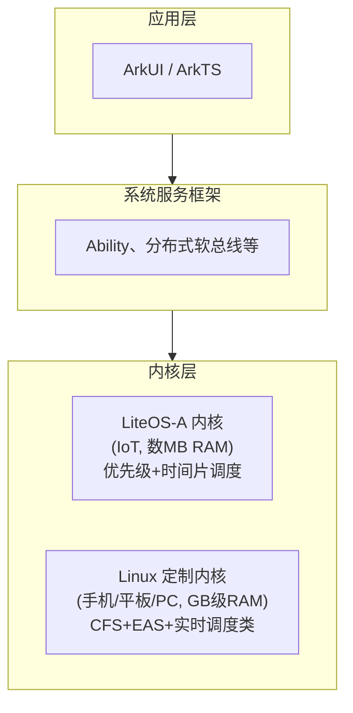
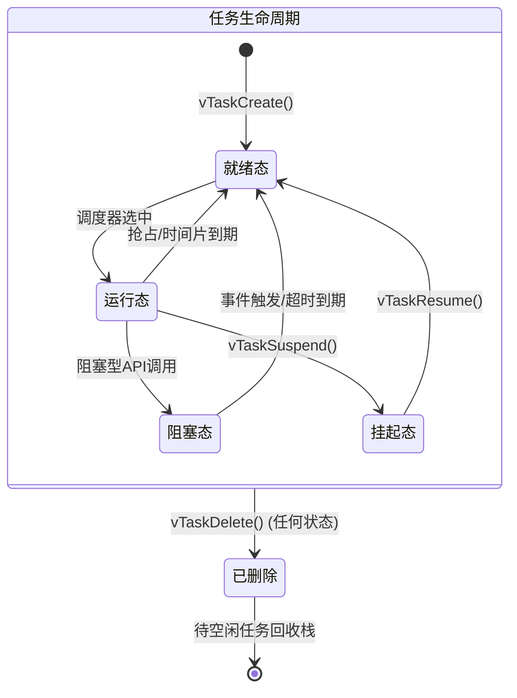

# Mermaid 渲染测试

本页面用于验证 Mermaid 图表的客户端渲染、主题配色与回退机制。

## Flowchart 流程图



## Gantt 甘特图

```mermaid
gantt
    title 固定优先级抢占式调度时序图 (H=3, M=2, L=1)
    dateFormat X
    axisFormat t%s

    section Task_H
    运行 :active, h1, 2, 4
    运行 :active, h2, 8, 9

    section Task_M
    运行 :active, m1, 4, 7

    section Task_L
    运行 :active, l1, 0, 2
    被H抢占 :crit, w1, 2, 4
    被M抢占 :crit, w2, 4, 7
    运行 :active, l2, 7, 8
    被H抢占 :crit, w3, 8, 9
    运行 :active, l3, 9, 12
```



## StateDiagram 状态机



## 普通代码块（回归检查）

```c
int main(void) {
    return 0;
}
```

## 内联公式完整性（回归检查）

公式：$E = mc^2$，行内代码 `luckysheet`。
